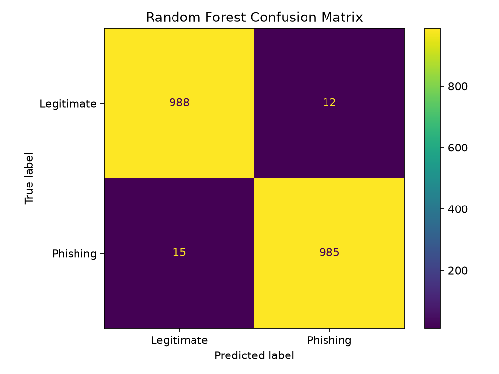

# Part 1 — Random Forest Phishing Detection

## Objective

Part 1 trains an optimized Random Forest classifier on a balanced dataset containing 10,000 website records. The supplied CSV contains 48 already-engineered numerical predictors plus the target column `CLASS_LABEL`.

The model uses:

- An 80/20 stratified train-test split
- Five-fold cross-validation
- Grid-search hyperparameter tuning
- Classification metrics
- A confusion matrix
- Feature-importance ranking
- Model serialization to `model.pkl`
- A Flask verifier for held-out records

## Dataset

- Total records: **10,000**
- Legitimate records: **5,000**
- Phishing records: **5,000**
- Predictive features: **48**
- Missing values: **0**
- Duplicate rows: **0**
- Label convention: `0 = Legitimate`, `1 = Phishing`

The actual dataset is not committed by default. Place an authorized copy at:

```text
part1-random-forest/phishing.csv
```

## Final model configuration

```python
{
    "max_depth": 20,
    "min_samples_leaf": 1,
    "min_samples_split": 2,
    "n_estimators": 300
}
```

## Final results

| Metric | Result |
|---|---:|
| Cross-validation accuracy | 98.2125% |
| Test accuracy | **98.6500%** |
| Phishing precision | **98.7964%** |
| Phishing recall | **98.5000%** |
| Phishing F1-score | **98.6480%** |
| ROC-AUC | **0.9990** |

### Confusion matrix

| Actual class | Predicted legitimate | Predicted phishing |
|---|---:|---:|
| Legitimate | 988 | 12 |
| Phishing | 15 | 985 |



## Setup

### Windows PowerShell

```powershell
py -3.11 -m venv .venv
Set-ExecutionPolicy -Scope Process -ExecutionPolicy RemoteSigned
.\.venv\Scripts\Activate.ps1
python -m pip install --upgrade pip
python -m pip install -r requirements.txt
```

## Run the project

Inspect the dataset:

```powershell
python .\inspect_data.py
```

Train and evaluate the model:

```powershell
python .\train_advanced.py
```

Start the Flask verifier:

```powershell
python .\app.py
```

Open:

```text
http://127.0.0.1:5000
```

## Why the Part 1 UI uses held-out records

The trained model expects 48 numerical features. Several features require webpage or HTML analysis and cannot be reconstructed from a raw URL string alone. The Flask application therefore demonstrates valid inference using records from the untouched 20% test split.

## Engineering problems resolved

- Corrected the working-directory and file-path layout.
- Installed missing packages inside the correct virtual environment.
- Replaced damaged code copied from formatted documents.
- Removed the non-predictive `id` column before training.
- Preserved the exact feature order with model metadata.
- Added saved metrics, confusion matrix, and feature importance.
- Corrected the Flask template structure after a `TemplateNotFound` error.
- Avoided connecting a 13-feature raw-URL extractor to a model trained on 48 features.

## Generated files

Training creates:

```text
model.pkl
reports/
├── classification_report.txt
├── confusion_matrix.png
├── feature_importance.csv
└── metrics.json
```

`model.pkl` is generated locally and ignored by Git by default.
