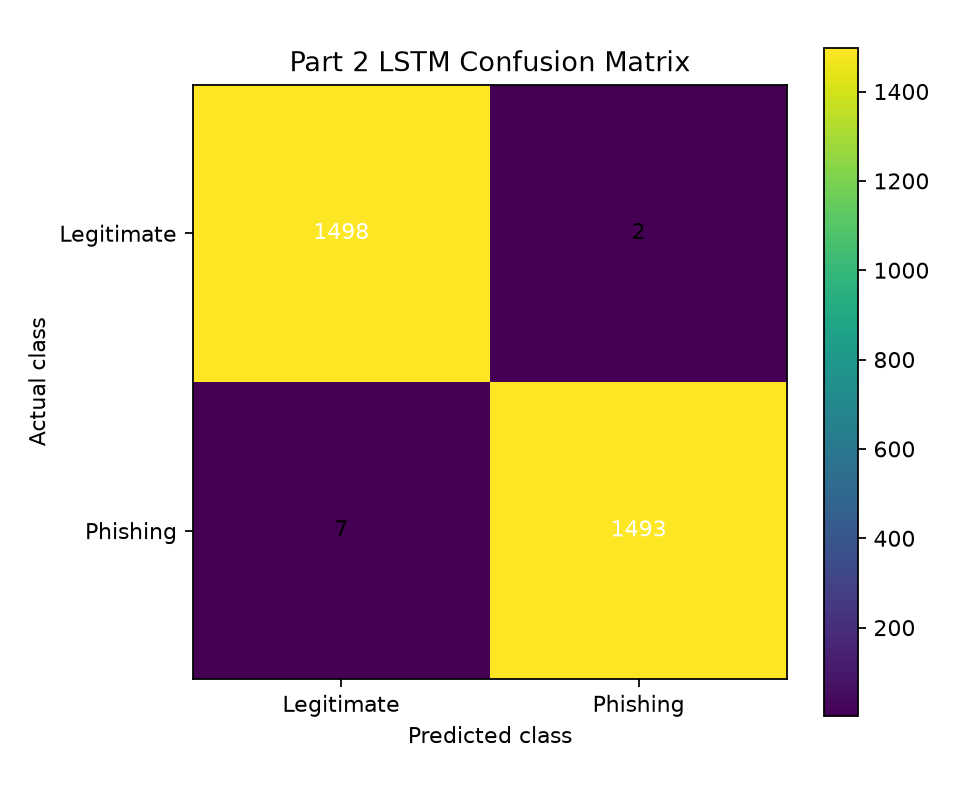
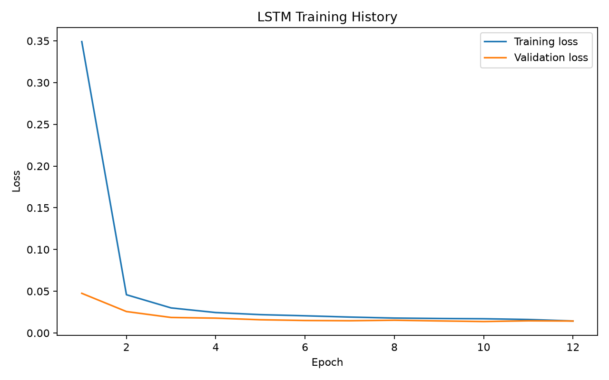

# Part 2 — Character-Level Bi-LSTM URL Classifier

## Objective

Part 2 trains a PyTorch bidirectional LSTM to classify raw URL strings. Instead of receiving manually engineered features, the network learns patterns directly from URL character sequences.

The pipeline performs:

1. Raw-URL dataset preparation
2. Cleaning and duplicate removal
3. Label normalization
4. Character vocabulary construction
5. Padding or truncation to a fixed sequence length
6. Embedding and bidirectional LSTM training
7. Validation-based model selection
8. Final test evaluation
9. Command-line inference
10. Flask web deployment

## Dataset

A balanced 20,000-URL sample was prepared from the UCI PhiUSIIL phishing URL dataset:

- Legitimate URLs: **10,000**
- Phishing URLs: **10,000**
- Training URLs: **14,000**
- Validation URLs: **3,000**
- Test URLs: **3,000**
- Duplicate URLs: **0**
- Missing values: **0**
- Label convention: `0 = Legitimate`, `1 = Phishing`

The generated dataset is not committed. Recreate it with the preparation script.

## Model configuration

- Framework: **PyTorch**
- Model: **Character-level bidirectional LSTM**
- Vocabulary size: **60**
- Maximum sequence length: **200**
- Epochs completed: **12**
- Device used: **CPU**
- Decision threshold: **0.50**

## Final results

| Metric | Result |
|---|---:|
| Test accuracy | **99.70%** |
| Phishing precision | **99.8662%** |
| Phishing recall | **99.5333%** |
| Phishing F1-score | **99.6995%** |
| ROC-AUC | **0.99897** |

### Confusion matrix

| Actual class | Predicted legitimate | Predicted phishing |
|---|---:|---:|
| Legitimate | 1,498 | 2 |
| Phishing | 7 | 1,493 |



### Training history



Training loss decreased from approximately 0.3491 to 0.0144, while validation loss decreased from approximately 0.0475 to 0.0143.

## Setup

### Windows PowerShell

```powershell
py -3.11 -m venv .venv
Set-ExecutionPolicy -Scope Process -ExecutionPolicy RemoteSigned
.\.venv\Scripts\Activate.ps1
python -m pip install --upgrade pip
python -m pip install -r requirements.txt
python -m pip install torch --index-url https://download.pytorch.org/whl/cpu
```

## Prepare the raw URL data

```powershell
python .\prepare_raw_url_data.py --per-class 10000
python .\inspect_raw_data.py
```

## Train the LSTM

```powershell
python .\train_lstm.py --epochs 12 --batch-size 256 --max-length 200
```

## Test one URL locally

```powershell
python .\predict_url.py "http://secure-login-verify-example.test/account"
```

## Run the web interface

```powershell
python .\app.py
```

Open:

```text
http://127.0.0.1:5001
```

The application analyzes the URL text locally; it does not visit the submitted website.

## Engineering problems resolved

- The Part 1 feature CSV did not contain raw URL strings, so a separate raw-URL dataset was required.
- The original TensorFlow design was replaced with PyTorch.
- The UCI label direction was converted to the project convention.
- Duplicate and blank URLs were removed before sampling.
- A separate training, validation, and test split was used.
- The character vocabulary was built from training URLs only.
- The best model state was restored before final testing.
- A PyTorch-compatible Flask UI was created.

## Important limitation

The held-out test score was extremely strong, but an independently selected legitimate URL, `https://www.python.org/`, was classified as phishing with a 75.45% phishing probability. This false positive demonstrates that excellent in-dataset performance does not guarantee correct classification for every external URL.

## Generated files

Training creates:

```text
artifacts/lstm_model.pt
reports/
├── classification_report.txt
├── confusion_matrix.png
├── metrics.json
├── training_history.csv
├── training_history.png
└── test_predictions.csv
```

The trained `.pt` model, generated dataset, and per-URL prediction export are ignored by Git by default.
